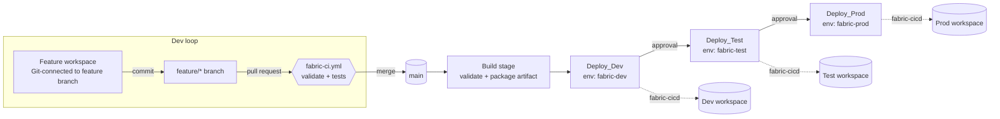

# Microsoft Fabric CI/CD on Azure DevOps: build once, promote through Dev, Test and Prod

An end-to-end, secret-free Azure DevOps setup for Microsoft Fabric that combines the lessons from the other CI/CD accelerators in this folder into one opinionated, production-ready starting point:

| Capability | How this accelerator does it |
| --- | --- |
| Deployment engine | [`fabric-cicd`](https://microsoft.github.io/fabric-cicd/) (code-first, Microsoft supported Python library) |
| Authentication | Azure Resource Manager service connection with **workload identity federation**. No client secret, no PAT, no device-code login, nothing echoed to logs |
| Branching | Trunk-based. Feature workspaces branch out from `main`; a merged PR builds **one** artifact that is promoted unchanged through every environment |
| Gates | Azure DevOps **environments** (`fabric-dev`, `fabric-test`, `fabric-prod`) with approvals and checks configured in the portal, not in YAML |
| Quality | A pull request pipeline validates item folders, `.platform` files, the parameter file and scans for committed secrets before anything can merge |
| Configuration | A single `config/parameter.yml` rewrites ids, connections and schedules per environment using fabric-cicd dynamic variables |
| Post-deployment | Optional notebook run in the target workspace through the Job Scheduler API, polled to completion |
| Failure handling | Every script exits non-zero and raises `##vso` errors, so a failed deployment fails the stage |



If your organisation uses one branch per environment instead (Gitflow style), see [Adapting to branch-per-environment](#adapting-to-branch-per-environment).

## Contents

```
Azure-DevOps-end-to-end-fabric-cicd/
├── pipelines/
│   ├── fabric-ci.yml                 # PR validation (attach as a branch policy on main)
│   ├── fabric-cd.yml                 # Build -> Dev -> Test -> Prod
│   ├── templates/
│   │   ├── stage-deploy.yml          # reusable deployment stage (one per workspace)
│   │   ├── steps-setup-python.yml    # Python + dependencies
│   │   └── steps-validate.yml        # validator + unit tests + reports
│   └── variables/
│       ├── common.yml                # service connection, folders, environment keys
│       ├── dev.yml | test.yml | prod.yml   # workspace per environment
├── scripts/
│   ├── fabric_deploy.py              # publishes the repository with fabric-cicd
│   ├── validate_repo.py              # static validation used by CI and the Build stage
│   ├── run_post_deploy_notebook.py   # runs a notebook after a deployment and waits
│   ├── fabric_auth.py                # credential modes: cli | pipelines | spn | default
│   ├── fabric_api.py                 # workspace/item lookup and job polling helpers
│   ├── requirements.txt
│   └── tests/                        # pytest suite, runs in CI
├── config/
│   └── parameter.yml                 # per-environment replacements (fabric-cicd)
└── workspace/                        # sample exported workspace (replace with yours)
```

## Prerequisites

1. **Three Fabric workspaces** (Dev, Test, Prod) on a Fabric capacity. Note their names; the pipeline resolves ids at run time (or set the id in the variable file).
2. **An identity for the pipeline.** Either a user-assigned managed identity or an Entra app registration. It must be:
   * a member of a security group allowed by the tenant setting **Developer settings > Service principals can use Fabric APIs**;
   * **Contributor** on each target workspace (**Admin** if you want orphan removal to delete items created by other users);
   * allowed to create the item types you deploy (some workloads have their own tenant switches, for example semantic models and reports need XMLA read/write for the capacity).
3. **Azure DevOps** project with an Azure Repos Git repository.
4. Python 3.10 or later on the agent. Microsoft-hosted `ubuntu-latest` agents already have it and the Azure CLI.

## Setup

### 1. Service connection (no secrets)

1. In Azure DevOps go to **Project settings > Service connections > New > Azure Resource Manager**.
2. Choose **Workload identity federation (automatic)** to let Azure DevOps create the app registration, or **(manual)** / **Managed identity** to reuse the identity from the prerequisites.
3. Name it `sc-fabric-cicd` (or change `fabricServiceConnection` in `pipelines/variables/common.yml`).
4. Scope it as narrowly as you like. The subscription scope is irrelevant for Fabric; the identity only needs Fabric permissions. Untick **Grant access permission to all pipelines** and authorise the two pipelines explicitly later.
5. Add the identity to the Fabric security group and to the three workspaces as described in the prerequisites.

Why this works: the `AzureCLI@2` task logs the agent in with a federated token, and `fabric_deploy.py` reads that session through `AzureCliCredential`. Nothing is stored, and rotating credentials is no longer your problem.

> Tenants that cannot use federation yet can link a variable group to Key Vault and run the scripts with `--auth spn`. Map the secrets to `FABRIC_TENANT_ID`, `FABRIC_CLIENT_ID` and `FABRIC_CLIENT_SECRET` via the task `env:` block, never as command-line arguments.

### 2. Repository layout

Copy this folder into the root of your Azure Repos repository so that the layout matches the [Contents](#contents) section. Then export your Dev (or a feature) workspace into `workspace/`:

1. Workspace settings > **Git integration** > connect to `main` (or a feature branch) with **Git folder** = `workspace`.
2. Commit all items once, then **disconnect** the Dev workspace. From now on Dev is deployed by the pipeline. Feature workspaces stay connected to their feature branches ([branch out to a new workspace](../Branch-out-to-new-workspace/README.md) automates that).

Delete the three sample items in `workspace/` once your own export is in place.

### 3. Variables

* `pipelines/variables/common.yml`: service connection name, workspace folder, parameter file, environment keys, item types validated in CI.
* `pipelines/variables/dev.yml`, `test.yml`, `prod.yml`: workspace name (or id), fabric-cicd environment key, optional post-deployment notebook.

Values that must stay out of Git (SQL endpoints, connection ids) can be referenced from `parameter.yml` as `$ENV:NAME` and supplied through a **variable group** or a **Fabric variable library**.

### 4. Environments and approvals

Create three environments under **Pipelines > Environments**: `fabric-dev`, `fabric-test`, `fabric-prod`. On `fabric-test` and `fabric-prod` add **Approvals** (release manager) and, if you need them, **Business hours** and **Branch control** checks (only `refs/heads/main` may deploy to Prod). The YAML never has to change when your governance does.

### 5. Pipelines

Create two pipelines from **Existing Azure Pipelines YAML file**:

| Pipeline | YAML | Trigger |
| --- | --- | --- |
| `fabric-ci` | `pipelines/fabric-ci.yml` | Pull requests to `main` |
| `fabric-cd` | `pipelines/fabric-cd.yml` | Merges to `main` (paths `workspace/**`, `config/**`, `pipelines/**`, `scripts/**`) |

Authorise both to use the service connection and the environments on first run.

### 6. Branch policy on `main`

**Repos > Branches > main > Branch policies**: require a minimum number of reviewers, and add `fabric-ci` as a **Build validation** policy. This blocks direct commits and makes the validator a hard gate.

## Day-to-day flow

1. A developer branches out to a feature workspace, works in Fabric, commits to the feature branch.
2. They open a PR to `main`. `fabric-ci` runs the validator and unit tests and reports issues inline.
3. After review the PR is completed. `fabric-cd` builds the artifact and deploys to Dev automatically.
4. The release manager approves `fabric-test`, runs their tests, then approves `fabric-prod`.
5. Every stage prints the build metadata it deployed (`build-info.json`) so the audit trail lives in the run.

Run `fabric-cd` manually to redeploy a specific artifact, narrow `itemTypesInScope`, or untick a stage.

## The parameter file

`config/parameter.yml` is the only file that knows about environment differences. It supports:

* `find_replace`: literal or regex replacement in item definitions (ids, endpoints, names).
* `key_value_replace`: JSONPath replacement inside JSON and YAML definitions (activity properties, `.schedules`).
* `spark_pool`: map Dev custom pools to their Test/Prod counterparts.

Dynamic values such as `$workspace.$id` and `$items.Lakehouse.lh_sales.$id` are resolved after the referenced item is published, so cross-item references stay correct without you maintaining a table of GUIDs. The CI validator checks that every entry covers every environment listed in `fabricEnvironments` and warns when a `find_value` no longer exists in the repository.

## Running the scripts locally

```bash
az login
pip install -r scripts/requirements.txt
python scripts/validate_repo.py --repository-directory workspace --parameter-file config/parameter.yml
python scripts/fabric_deploy.py --workspace-name Fabric-CICD-Dev --environment DEV \
    --repository-directory workspace --parameter-file config/parameter.yml --item-types Notebook,Lakehouse --dry-run
```

Drop `--dry-run` to deploy with your own identity. Use `--auth default` on machines without the Azure CLI.

## Adapting to branch-per-environment

If each environment has its own long-lived branch (`dev`, `test`, `prod`):

1. In `fabric-cd.yml` set `trigger.branches.include` to the three branches.
2. Replace the three stage template calls with one, and pick the variable template from the branch, for example `variableTemplate: variables/${{ replace(variables['Build.SourceBranch'], 'refs/heads/', '') }}.yml`.
3. Keep environment approvals; they still apply per stage.

Everything else, including the validator and the parameter file, stays the same.

## Troubleshooting

| Symptom | Likely cause |
| --- | --- |
| `Workspace 'x' was not found or the deployment identity has no access` | The identity is not a member of the workspace, or the tenant setting for service principals is off |
| `401` from `api.fabric.microsoft.com` inside `AzureCLI@2` | Service connection not authorised for the pipeline, or the identity is not in the allowed security group |
| `Unsupported item type` | The type is not (yet) handled by the installed fabric-cicd version; upgrade `scripts/requirements.txt` or remove it from `itemTypesInScope` |
| Items published but reports point at the wrong model | Add a `find_replace` for the semantic model id in `definition.pbir`; see the sample parameter file |
| Post-deployment notebook step is skipped | `postDeployNotebookName` is empty in the environment variable file |
| Notebook job fails with 403 | The notebook (or its default lakehouse) is not shared with the deployment identity |

## Relationship to the other CI/CD accelerators

* [Git-based deployments](../Git-based-deployments/README.md): uses the Fabric Git APIs and one branch per environment. Good when the Git integration feature set (conflict policies, commit history in the workspace) is what you want.
* [Git-based deployments using build environments](../Git-based-deployments-using-Build-environments/readme.md): the single-stage `fabric-cicd` sample this accelerator extends with CI, artifact promotion, environments and federated auth.
* [Deploy using Fabric deployment pipelines](../Deploy-using-Fabric-deployment-pipelines/README.md): workspace-to-workspace promotion with deployment pipelines when you prefer Fabric-native rules over a parameter file.
* [Git-based deployment with sqlproj schemas](../Git-based-deployment-with-sqlproj-schemas/README.md): add it when you also need DACPAC based schema deployments for warehouses.

## Limitations

* Service principals are not supported for every Fabric item type or operation. Check the [fabric-cicd item support matrix](https://microsoft.github.io/fabric-cicd/latest/) and the Fabric documentation for the workloads you deploy.
* Data is never moved by this accelerator. Seed or copy data with the post-deployment notebook.
* The secret scan is heuristic. Keep a proper secret scanning policy enabled on the repository as well.
